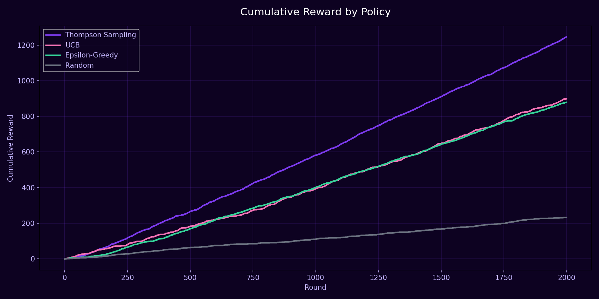
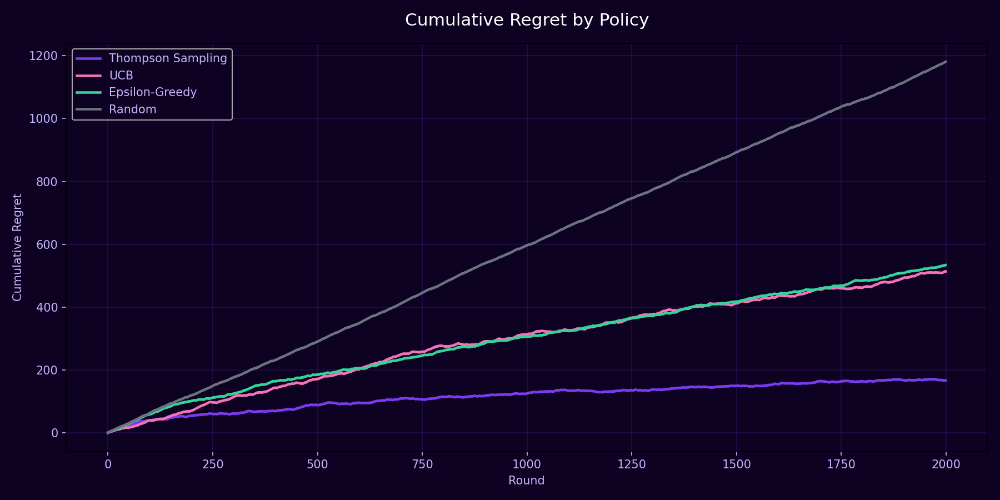

# 🎰 Smart Outreach Optimization with Multi-Armed Bandits
### Thompson Sampling vs UCB vs Epsilon-Greedy — Bank Marketing Dataset

---

## 📌 Overview

A Portuguese bank wants to know **which outreach strategy** leads to the
highest chance a customer opens a term deposit — considering *when* they're
contacted (season), *how often* (campaign frequency), and *what happened*
in the previous campaign (prior outcome).

Instead of a slow, wasteful traditional A/B test — where clearly-bad
strategies keep getting equal traffic long after we know they're bad — this
project uses **Multi-Armed Bandit algorithms** to balance exploration and
exploitation, converging on the best strategy faster while minimizing lost
conversions ("regret") along the way.

Since the data is **historical (logged)**, not a live interactive
environment, the project uses a **multi-pass Replay Method** — a standard
offline bandit evaluation technique — to fairly simulate how each algorithm
would have performed if it had been making real-time decisions.

First project in this portfolio combining **Reinforcement Learning** with a
real, messy, imbalanced business dataset.

---

## 📂 Dataset

| Property | Value |
|----------|-------|
| Source | UCI Machine Learning Repository — Bank Marketing Dataset |
| Rows | 45,211 |
| Original Features | 17 |
| Target | `y` (did the customer subscribe to a term deposit?) |
| Baseline Conversion Rate | 11.61% |

---

## 🎯 Arm Engineering

Each **arm** represents a distinct, actionable outreach strategy:

`Season of Contact  ×  Campaign Frequency Bucket  ×  Previous Campaign Outcome`

| Dimension | Buckets |
|---|---|
| Season | Winter, Spring, Summer, Autumn |
| Campaign Frequency | Low (1 call), Medium (2–3 calls), High (4+ calls) |
| Previous Outcome | unknown, failure, other, success |

This produced **48 candidate arms**; arms with fewer than 30 logged samples
were dropped (insufficient data for reliable offline evaluation), leaving
**44 arms** covering 45,096 rows.

---

## ⚙️ Pipeline

Raw Data → Arm Engineering → Filter Sparse Arms → Bandit Algorithms → Multi-Pass Replay Method → Evaluation

---

## 🤖 Algorithms Compared

| Algorithm | Type | Strategy |
|---|---|---|
| **Thompson Sampling** | Bayesian | Sample from each arm's Beta distribution, pick the highest |
| **UCB (Upper Confidence Bound)** | Frequentist | Pick the arm with the highest optimistic estimate |
| **Epsilon-Greedy** | Heuristic | 90% exploit best-known arm, 10% explore randomly |
| **Random** | Baseline | Uniform random — mirrors traditional A/B testing |

All four share a common `select_arm()` / `update()` interface, evaluated
through the same **Replay Method** framework for a fair, apples-to-apples
comparison.

### Why Multi-Pass Replay?

With 44 arms, a single pass through ~45K logged rows isn't enough for a
converged policy to accumulate sufficient *matched* rounds (rounds where the
algorithm's chosen arm matches what actually happened historically). Each
policy therefore makes multiple passes over freshly reshuffled data until it
reaches 2,000 accepted rounds — a standard adaptation of the Replay Method
for limited historical data.

---

## 📈 Results

### Cumulative Reward

### Cumulative Regret

| Policy | Accepted Rounds | Avg. Reward |
|---|---|---|
| 🥇 **Thompson Sampling** | 2,000 | **0.6230** |
| 🥈 UCB | 2,000 | 0.4495 |
| 🥉 Epsilon-Greedy | 2,000 | 0.4395 |
| Random (baseline) | 2,000 | 0.1160 |

---

## 💼 Business Impact

| Metric | Value |
|---|---|
| Overall dataset conversion rate | 11.61% |
| Random policy (≈ traditional A/B testing) | 11.60% |
| **Thompson Sampling** | **62.30%** |
| **Lift vs. traditional A/B testing** | **+437.1%** |

In practical terms: for the same number of outreach calls, switching from a
traditional equal-allocation strategy to Thompson Sampling could increase
the bank's term-deposit conversion rate more than **5x** within the
high-performing arm segments — with no additional cost per call.

---

## 💡 Key Insights

- **Sanity check passed**: the Random policy's average reward (11.60%)
  almost exactly matches the dataset's overall conversion rate (11.61%),
  confirming the Replay Method pipeline is unbiased and correctly implemented.
- **Thompson Sampling learned the right thing, not just a lucky number**:
  4 of its top 5 most-chosen arms are also in the ground-truth top 5 arms by
  true conversion rate.
- **"Previous success" is the single strongest signal**: every one of the
  top 5 arms — by both Thompson Sampling's choices and true conversion
  rate — has `poutcome = success`. Customers who converted in a past
  campaign are dramatically more likely to convert again.
- **Multi-pass replay was necessary**: a single pass left every policy with
  under 300 accepted rounds — too noisy to compare fairly. Reshuffling
  across multiple passes was required to reach a stable 2,000-round sample
  for each policy.
- **UCB and Epsilon-Greedy performed similarly** (~0.44–0.45), both clearly
  beating Random but well behind Thompson Sampling — consistent with theory,
  since both spend more rounds on non-adaptive or forced exploration.

---

## 🛠️ Tech Stack

