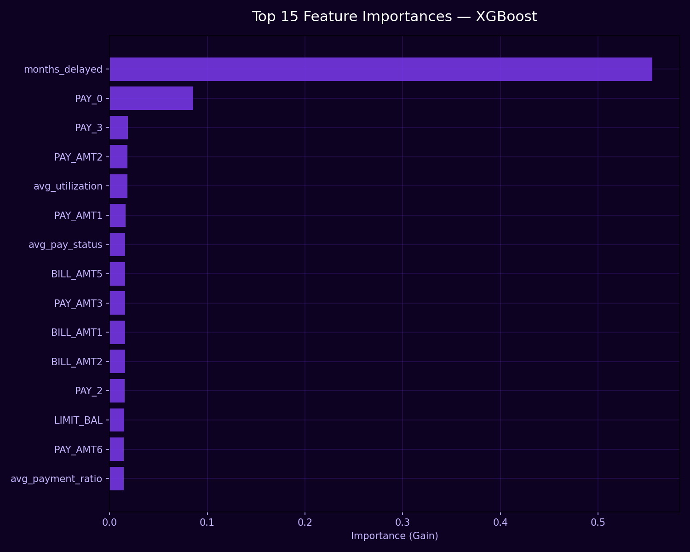
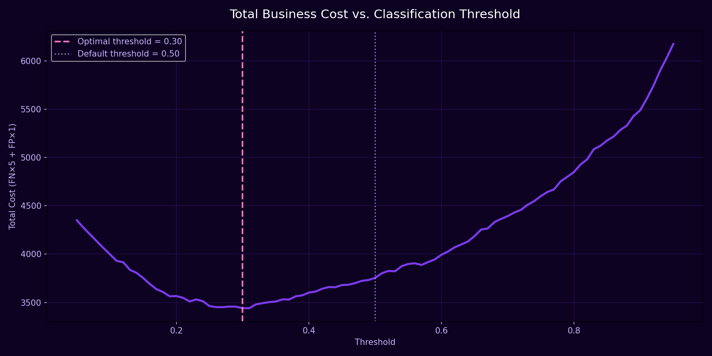
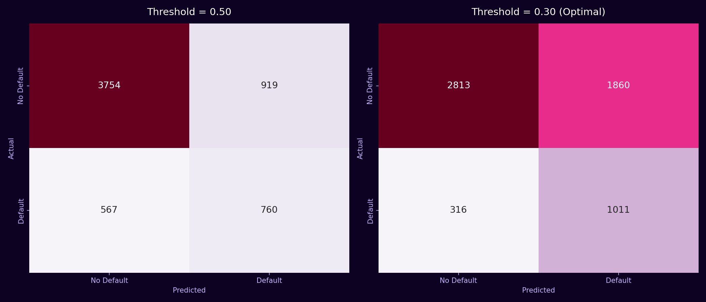
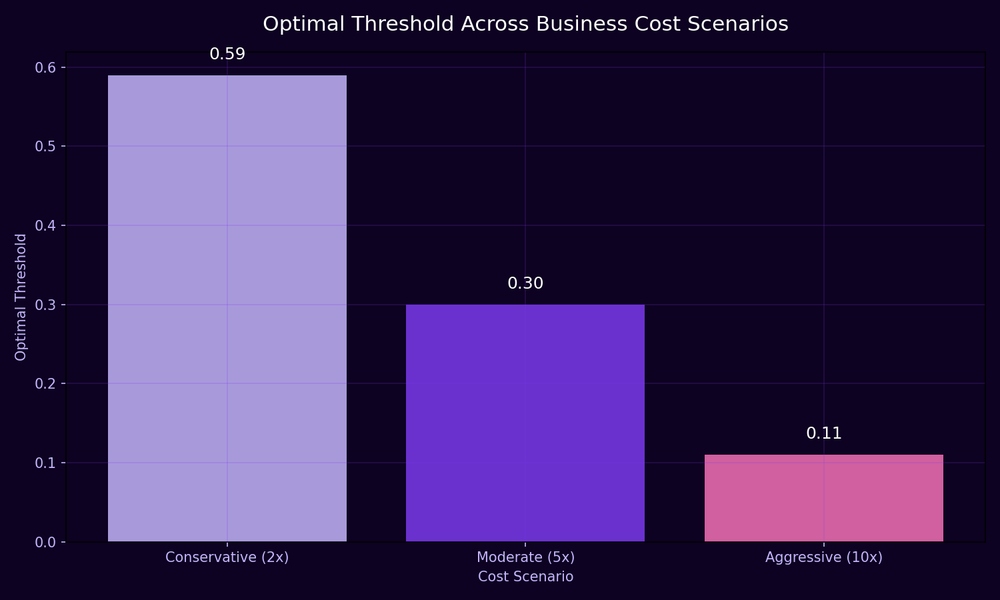

# 💳 Credit Card Default Prediction with XGBoost
### Cost-Sensitive Classification — UCI Default of Credit Card Clients Dataset

---

## 📌 Overview

A financial institution wants to predict **which credit card customers are
likely to default** on their payment next month, using demographic info and
6 months of billing/payment history.

Unlike a standard "maximize accuracy" classification task, this is a
**cost-sensitive problem**: missing an actual default (false negative) costs
the bank far more than flagging a good customer as risky (false positive).
This project uses **XGBoost**, tuned specifically for imbalanced data and
business-driven threshold selection — not just raw accuracy.

---

## 📂 Dataset

| Property | Value |
|----------|-------|
| Source | UCI Machine Learning Repository — Default of Credit Card Clients |
| Rows | 30,000 |
| Original Features | 23 |
| Target | `default payment next month` (0/1) |
| Baseline Default Rate | 22.12% |

---

## 🧹 Data Cleaning

- **`EDUCATION`**: undocumented codes `0`, `5`, `6` merged into the existing
  "Others" category (`4`)
- **`MARRIAGE`**: undocumented code `0` merged into "Others" (`3`)
- **`ID`** dropped — identifier column, no predictive value
- No missing values in the dataset

---

## ⚙️ Feature Engineering

5 behavioral features derived from the 6 months of raw payment/billing history:

| Feature | Description |
|---|---|
| `avg_pay_status` | Average delay status across 6 months |
| `months_delayed` | Count of months with an actual delay flag |
| `recent_delay` | Most recent month's delay status |
| `avg_utilization` | Average billed amount relative to credit limit |
| `avg_payment_ratio` | Total amount paid relative to total amount billed (aggregate ratio, not averaged per-month, to avoid division blow-up when a single month's bill is near zero) |

---

## ⚙️ Pipeline

Raw Data → Cleaning → Feature Engineering → Stratified Split → Baseline Model
→ Stratified 5-Fold CV → Class Imbalance Handling → Cost-Based Threshold Tuning
→ Multi-Scenario Analysis → Feature Importance

---

## 🤖 Modeling Approach

1. **Baseline XGBoost** (default settings) — reference point
2. **Stratified 5-Fold CV** — validated the baseline wasn't a lucky split
3. **`scale_pos_weight`** — addressed class imbalance at training time
4. **Cost-based threshold tuning** — optimized the decision threshold
   against real business cost, not the default 0.5 cutoff
5. **Multi-scenario analysis** — tested how the optimal threshold shifts
   across different assumed cost ratios

---

## 📈 Results

### Model Performance (Stratified 5-Fold CV)

| Model | ROC-AUC | Precision (Default) | Recall (Default) | F1 (Default) |
|---|---|---|---|---|
| Baseline XGBoost | 0.7617 ± 0.0062 | 0.6286 ± 0.0030 | 0.3739 ± 0.0082 | 0.4688 ± 0.0066 |
| **+ scale_pos_weight** | 0.7578 ± 0.0067 | 0.4670 ± 0.0057 | **0.5656 ± 0.0056** | 0.5116 ± 0.0041 |

### Feature Importance

### Cost vs. Threshold

### Confusion Matrix — Default vs. Optimal Threshold

### Threshold Across Business Risk Scenarios

| Scenario | FN:FP Cost Ratio | Optimal Threshold | Recall (Default) | Precision (Default) |
|---|---|---|---|---|
| Conservative | 2:1 | 0.59 | 0.499 | 0.516 |
| Moderate | 5:1 | 0.30 | 0.762 | 0.352 |
| Aggressive | 10:1 | 0.11 | 0.935 | 0.262 |

---

## 💼 Business Impact

- **+51% improvement in default detection**: `scale_pos_weight` raised
  recall from 0.37 to 0.57, meaning far fewer at-risk customers slip through
  undetected.
- **8.4% cost reduction** from threshold tuning alone (Moderate scenario) —
  achieved with zero additional model training, just recalibrating the
  decision boundary against real business cost.
- **A tunable decision tool, not a fixed model**: the multi-scenario
  analysis shows the bank can dial the threshold to match its actual risk
  appetite — from a balanced 2:1 cost ratio up to an aggressive 10:1 ratio
  that catches 93.5% of defaults at the cost of more false alarms.

---

## 💡 Key Insights

- **`months_delayed` — an engineered feature — is by far the strongest
  predictor**, accounting for 55.6% of total model importance, ahead of
  every raw column including the most recent payment status (`PAY_0`).
  Summarizing 6 months of delay history into a single count captured more
  signal than any individual monthly snapshot.
- **Stratified 5-Fold CV confirmed the baseline wasn't a lucky split**: the
  cross-validated ROC-AUC (0.7617 ± 0.0062) matched the single train/test
  split almost exactly, with low variance across folds.
- **Precision/recall trade-off is real and must be chosen deliberately**:
  `scale_pos_weight` roughly doubled recall but nearly halved precision —
  neither number alone tells the full story; the right balance depends on
  the bank's actual cost structure.
- **A naive ratio-based feature can silently blow up**: averaging 6
  per-month payment ratios produced unstable extreme values when a single
  month's bill was near zero. Switching to an aggregate sum-based ratio
  fixed it — a reminder to sanity-check engineered features with
  `.describe()` before trusting them.
- **The "optimal" threshold has no single right answer** — it shifts
  materially (0.59 → 0.30 → 0.11) depending on the assumed cost ratio,
  reinforcing that threshold selection is a business decision, not a purely
  statistical one.

---

## 🛠️ Tech Stack

